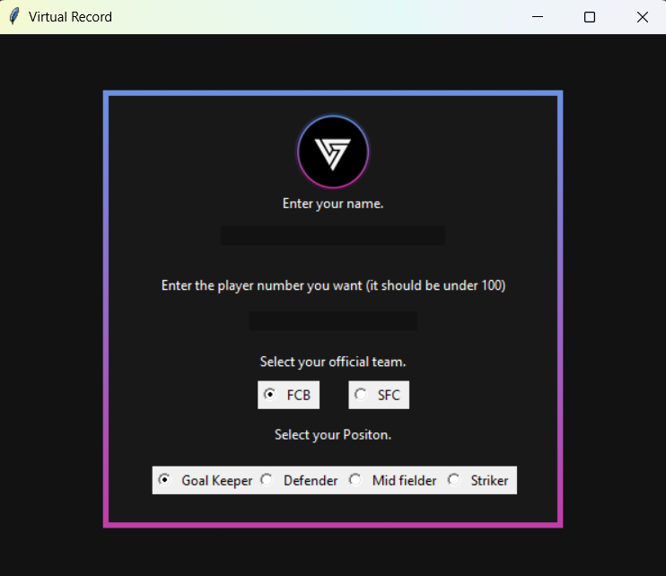

# Football Team Application Form
A project that allows users to upload their informant from client side to the server side and store it into a microsoft excel sheet.

## Table of Contents
- [Introduction](#introduction)
- [Installation](#installation)
- [Usage](#usage)

## Introduction
I developed this project to help my friends streamline the process of selecting team members and organizing match details in an Excel sheet. The goal was to simplify team selection for custom jerseys and match organization. However, assigning jersey numbers and team placements often led to conflicts. This app allows users to choose their team, preferred number, and position in a more organized way. With a user-friendly GUI built using the Tkinter module and provided data flow by socket networking, the app ensures a smooth and efficient team selection process for everyone involved.




## Installation
1. Clone the repository

```bash
git clone https://github.com/Muzzamil-codes/Football-Team-Application-Form.git
```

2. Install dependecies

```bash
pip install -r requirements.txt
```

## Usage

To run the application, follow these steps:

1. Open your command line interface (Bash, Command Prompt, or Git Bash).

2. Navigate to the project directory. Use the following command, replacing `<path-to-your-project>` with the actual path to your project folder:

   - **On Windows:**
     ```bash
     cd <path-to-your-project>
     ```

   - **On macOS/Linux:**
     ```bash
     cd <path-to-your-project>
     ```

3. Once you are in the project directory, run the server using Python:

   ```bash
   python server.py

4. After this you run the client program which is present in the same folder:
    ```bash
    python "Virtual Service.py"
    ```
